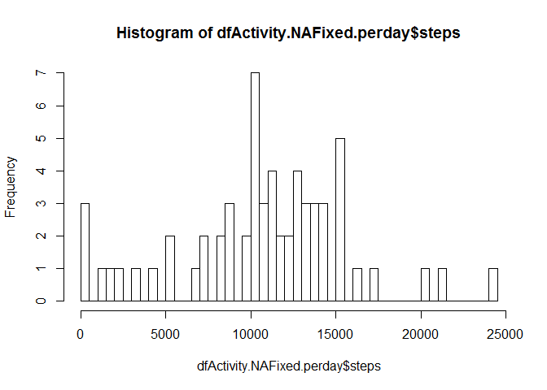

# Reproducible Research: Peer Assessment 1


## Loading and preprocessing the data
Load the data frame containing the activity

```r
#setwd("c:/wb/repdata/RepData_PeerAssessment1")
if (!file.exists("./activity.csv")) 
{
  f<- download.file(url = 'http://d396qusza40orc.cloudfront.net/repdata%2Fdata%2Factivity.zip' , destfile = "activity.zip") 
  activity.filename <-unzip("./activity.zip")
}
dfActivity <- read.csv ( file = "./activity.csv")
```

## What is mean total number of steps taken per day?
For this part of the assignment, you can ignore the missing values in the dataset.
Make a histogram of the total number of steps taken each day

```r
library(reshape)
dfActivity.perday <- aggregate( steps~date, data = dfActivity,FUN  =sum ) 
hist(dfActivity.perday$steps , breaks = 50 )
```

 

Calculate and report the mean and median total number of steps taken per day

```r
mean(dfActivity.perday$steps)
```

```
## [1] 10766.19
```

```r
median(dfActivity.perday$steps)
```

```
## [1] 10765
```


## What is the average daily activity pattern?
Make a time series plot (i.e. type = "l") of the 5-minute interval (x-axis) and the average number of steps taken, averaged across all days (y-axis)


```r
dfActivity.perinterval <- aggregate( steps~interval, data = dfActivity,FUN  =mean)
plot( y=dfActivity.perinterval$steps , x=dfActivity.perinterval$interval , type="l",  col="blue")
```

 

Which 5-minute interval, on average across all the days in the dataset, contains the maximum number of steps?

```r
maxNumStepsInAInterval       <- max( dfActivity.perinterval$steps )
maxNumStepsInAInterval.index <- match( maxNumStepsInAInterval, dfActivity.perinterval$steps)
tmpi<-dfActivity.perinterval[maxNumStepsInAInterval.index,]$interval
```
Interval `tmpi` on average has the higest numbr of steps.


## Imputing missing values
Note that there are a number of days/intervals where there are missing values (coded as NA). The presence of missing days may introduce bias into some calculations or summaries of the data.
Calculate and report the total number of missing values in the dataset (i.e. the total number of rows with NAs)

```r
totalRowsWithNA <- sum(is.na( dfActivity$steps))
```

Devise a strategy for filling in all of the missing values in the dataset. The strategy does not need to be sophisticated. For example, you could use the mean/median for that day, or the mean for that 5-minute interval, etc.
Create a new dataset that is equal to the original dataset but with the missing data filled in.


```r
dfActivity.NAfixed <- dfActivity
msk <- is.na(dfActivity$steps)  #the mask for the rows that have NA result
m1 <- merge(dfActivity[msk, ] , dfActivity.perinterval , books, by.x = "interval", by.y = "interval") #Get the average for the intervals that are NA
dfActivity.NAfixed[msk, ]$steps <- m1$steps.y
```
each interval that contain NA steps, has its NA swaped with the  average steps for that interval


Make a histogram of the total number of steps taken each day and Calculate and report the mean and median total number of steps taken per day. 

```r
dfActivity.NAFixed.perday <- aggregate( steps~date, data = dfActivity.NAfixed ,FUN  =sum)
hist(dfActivity.NAFixed.perday$steps , breaks = 50 )
```

 
Mean and median total number of steps taken per day on the naFixed dataset:

```r
mean( dfActivity.NAFixed.perday$steps)
```

```
## [1] 10766.19
```

```r
median(dfActivity.NAFixed.perday$steps)
```

```
## [1] 11015
```

```
Do these values differ from the estimates from the first part of the assignment? What is the impact of imputing missing data on the estimates of the total daily number of steps?

```r
impact <- merge( dfActivity.NAFixed.perday ,   dfActivity.perday ,  by.x = "date", by.y = "date", all=TRUE)
impact
```

```
##          date    steps.x steps.y
## 1  2012-10-01   137.6604      NA
## 2  2012-10-02   126.0000     126
## 3  2012-10-03 11352.0000   11352
## 4  2012-10-04 12116.0000   12116
## 5  2012-10-05 13294.0000   13294
## 6  2012-10-06 15420.0000   15420
## 7  2012-10-07 11015.0000   11015
## 8  2012-10-08  1294.9434      NA
## 9  2012-10-09 12811.0000   12811
## 10 2012-10-10  9900.0000    9900
## 11 2012-10-11 10304.0000   10304
## 12 2012-10-12 17382.0000   17382
## 13 2012-10-13 12426.0000   12426
## 14 2012-10-14 15098.0000   15098
## 15 2012-10-15 10139.0000   10139
## 16 2012-10-16 15084.0000   15084
## 17 2012-10-17 13452.0000   13452
## 18 2012-10-18 10056.0000   10056
## 19 2012-10-19 11829.0000   11829
## 20 2012-10-20 10395.0000   10395
## 21 2012-10-21  8821.0000    8821
## 22 2012-10-22 13460.0000   13460
## 23 2012-10-23  8918.0000    8918
## 24 2012-10-24  8355.0000    8355
## 25 2012-10-25  2492.0000    2492
## 26 2012-10-26  6778.0000    6778
## 27 2012-10-27 10119.0000   10119
## 28 2012-10-28 11458.0000   11458
## 29 2012-10-29  5018.0000    5018
## 30 2012-10-30  9819.0000    9819
## 31 2012-10-31 15414.0000   15414
## 32 2012-11-01 24443.9245      NA
## 33 2012-11-02 10600.0000   10600
## 34 2012-11-03 10571.0000   10571
## 35 2012-11-04 14460.5283      NA
## 36 2012-11-05 10439.0000   10439
## 37 2012-11-06  8334.0000    8334
## 38 2012-11-07 12883.0000   12883
## 39 2012-11-08  3219.0000    3219
## 40 2012-11-09 13823.0943      NA
## 41 2012-11-10 16458.4151      NA
## 42 2012-11-11 12608.0000   12608
## 43 2012-11-12 10765.0000   10765
## 44 2012-11-13  7336.0000    7336
## 45 2012-11-14 13675.4717      NA
## 46 2012-11-15    41.0000      41
## 47 2012-11-16  5441.0000    5441
## 48 2012-11-17 14339.0000   14339
## 49 2012-11-18 15110.0000   15110
## 50 2012-11-19  8841.0000    8841
## 51 2012-11-20  4472.0000    4472
## 52 2012-11-21 12787.0000   12787
## 53 2012-11-22 20427.0000   20427
## 54 2012-11-23 21194.0000   21194
## 55 2012-11-24 14478.0000   14478
## 56 2012-11-25 11834.0000   11834
## 57 2012-11-26 11162.0000   11162
## 58 2012-11-27 13646.0000   13646
## 59 2012-11-28 10183.0000   10183
## 60 2012-11-29  7047.0000    7047
## 61 2012-11-30  1835.4717      NA
```

```r
meanImpact<-mean( dfActivity.NAFixed.perday$steps) - mean(dfActivity.perday$steps)
medianImpact<-median(dfActivity.NAFixed.perday$steps) - median(dfActivity.perday$steps)
meanImpact
```

```
## [1] 0
```

```r
medianImpact
```

```
## [1] 250
```

As it can be seen, there are some days for which no number of steps is recroded. In the dfACtivity.NAFixed, I fixed this issue by using the interval average in the place of NA. No change in the mean as we swaped the NAs with mean, but median has changed. This is naturally  do to inclusion of more means. 


## Are there differences in activity patterns between weekdays and weekends?
For this part the weekdays() function may be of some help here. Use the dataset with the filled-in missing values for this part.
Create a new factor variable in the dataset with two levels - "weekday" and "weekend" indicating whether a given date is a weekday or weekend day.

```r
mskIsWeekend = weekdays( as.Date( dfActivity.NAfixed$date) ) %in% c("Sunday" , "Saturday" )  
dfActivity.NAfixed$daytype = "weekday"
dfActivity.NAfixed[mskIsWeekend, ]$daytype = "weekend"
dfActivity.NAfixed$daytype = as.factor ( dfActivity.NAfixed$daytype )
str(dfActivity.NAfixed)
```

```
## 'data.frame':	17568 obs. of  4 variables:
##  $ steps   : num  1.72 1.72 1.72 1.72 1.72 ...
##  $ date    : Factor w/ 61 levels "2012-10-01","2012-10-02",..: 1 1 1 1 1 1 1 1 1 1 ...
##  $ interval: int  0 5 10 15 20 25 30 35 40 45 ...
##  $ daytype : Factor w/ 2 levels "weekday","weekend": 1 1 1 1 1 1 1 1 1 1 ...
```


Make a panel plot containing a time series plot (i.e. type = "l") of the 5-minute interval (x-axis) and the average number of steps taken, averaged across all weekday days or weekend days (y-axis).


```r
library(lattice)
par(mfrow=c(1,1))
aggSteps <- aggregate ( steps~ interval + daytype ,  data=dfActivity.NAfixed , FUN=mean)

xyplot( steps~interval|daytype, 
        type = "l",
        xlab="Interval", ylab="Average Steps Taken Per Interval", 
        main="Steps taken in each interval in the day, by day type" , 
        layout=c(1, 2),
        data = aggSteps 
        )
```

 


